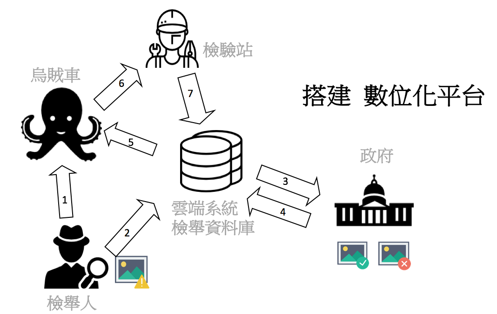
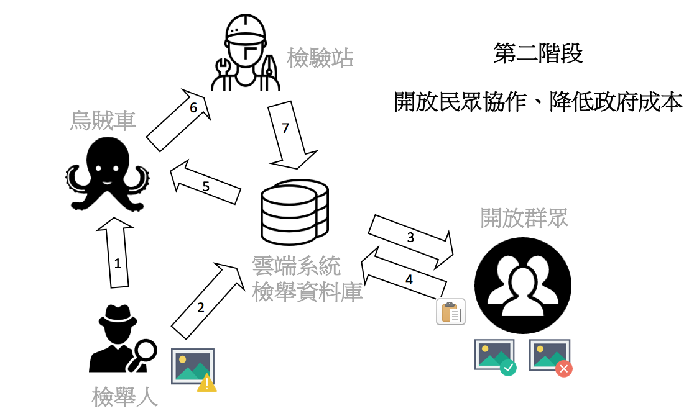
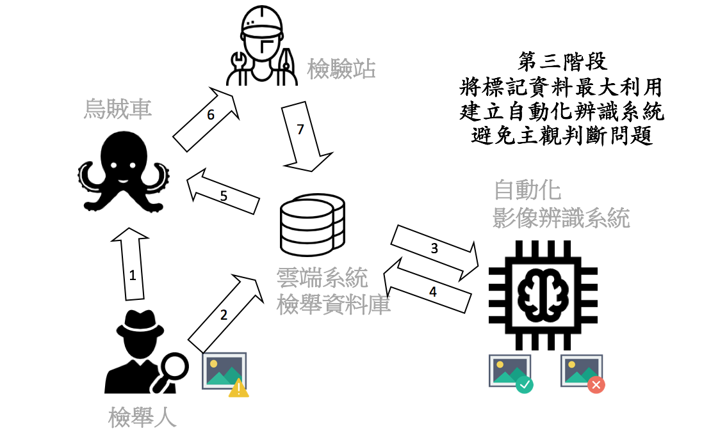
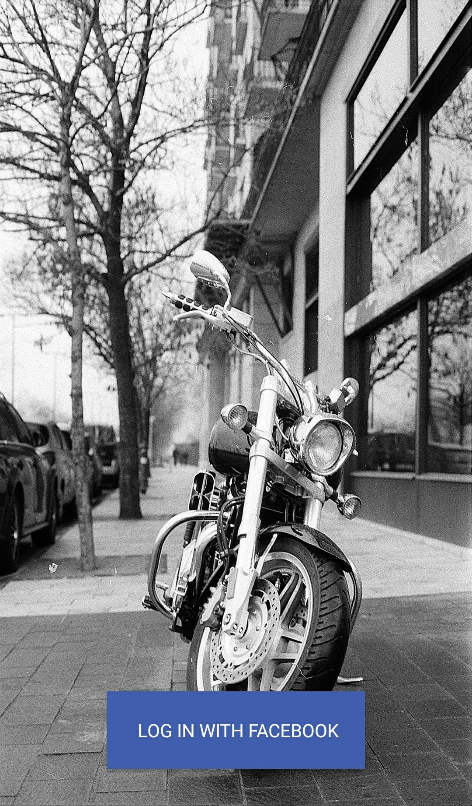
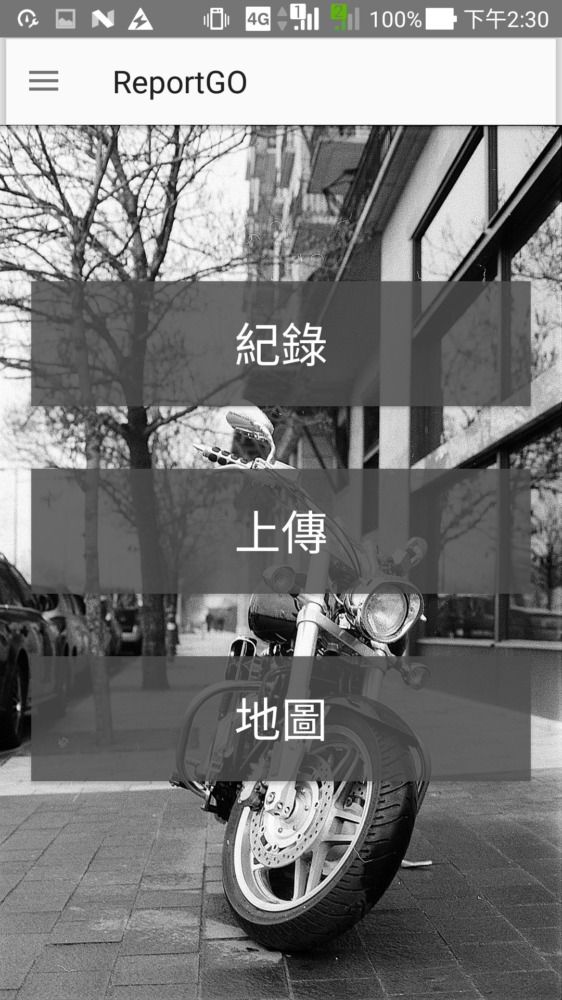
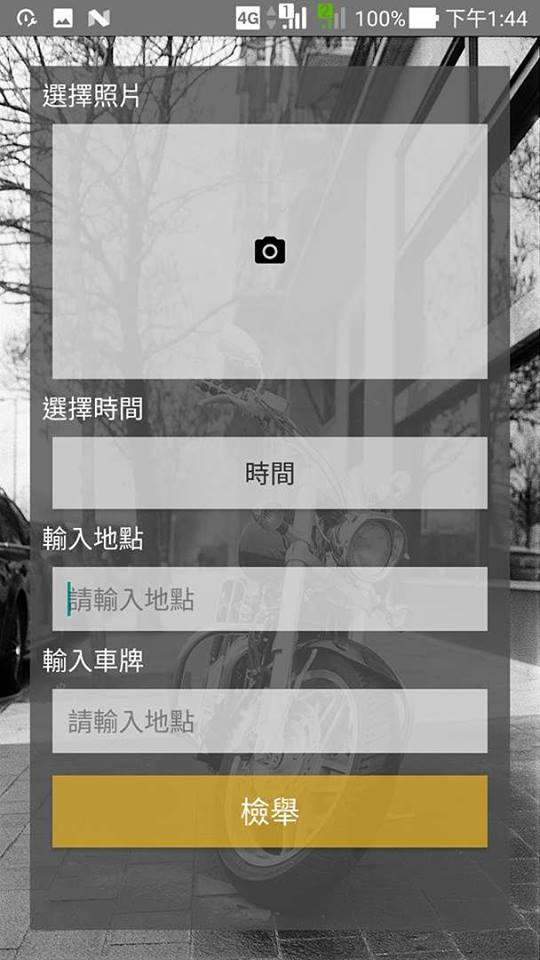
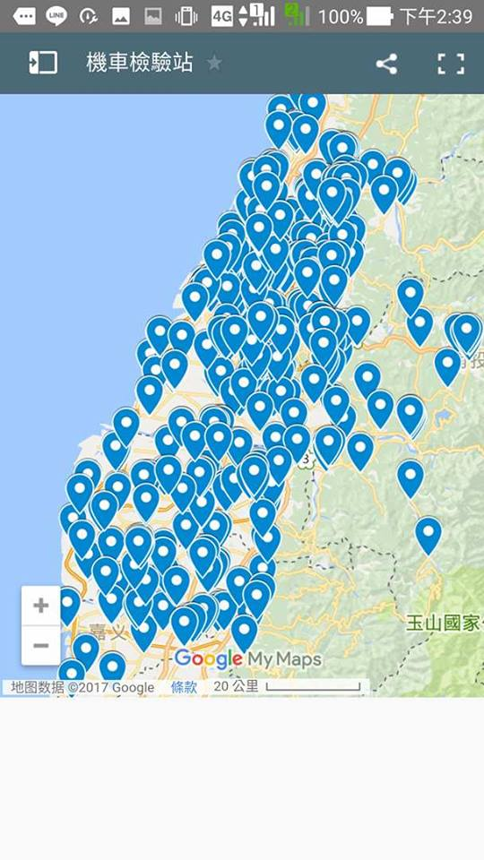

# 2017 嘉義黑蚵松 環境污染組
## 隊名：天大地大台科大
## 隊員：張絡鈞、林畇劭、 郭九一、  陳璿宇

## 問題：如何解決機車過量帶來的環境問題？

機車數量現階段無法完全改變，如何有效管治才是問題！

現行的法規雖然規範機車出廠滿五年後每年應接受排氣檢驗一次，但很多政府的統計數據都顯示目前的檢驗率只有30％~40％之間，這代表政府現行的方法無法有效地控管龐大的機車所衍生的污染，因此我們決定擴大民眾的監督力量，自己的污染問題自己解決！將既有的檢舉系統數位化、雲端化，建立一套完整並且可執行的計畫，讓資源更有效率地分配。

## 完整計畫
我們構想一個完整的計畫，此計畫分為三個階段，逐步在檢驗效率上做資源最有效運用！

第一階段. 建立數位化平台：提高溝通效率

第二階段. 民眾參與辨別烏賊車：資源配置效率化

第三階段. 建立自動化烏賊車辨識系統：降低人力成本

### 第一階段 數位化平台架構
架構圖

### 第二階段 數位化平台架構
架構圖

### 第三階段 數位化平台架構
架構圖

## 最小可行性 demo 
此計畫中，我們架設雲端伺服器，在手機app端可以上傳檢舉資料以及照片至資料庫中，我也可透過政府的檢驗站資料，提供被檢舉人地圖檢視的功能。

<table border=1>
<tr>
<td>
登入畫面
</td><td>
主頁面
</td><td>
檢舉頁面
</td><td>
檢驗站地圖資訊
</td></tr>

<tr><td>

</td><td>

</td><td>

</td><td>

</td></tr>
</table>

## 使用的資料

政府開放平台 

http://data.gov.tw/node/14208 
http://data.gov.tw/node/35726 
http://data.gov.tw/node/42225

行政院環境保護署

https://erdb.epa.gov.tw/DataRepository/ReportAndStatistics/StatSceMotors.aspx

